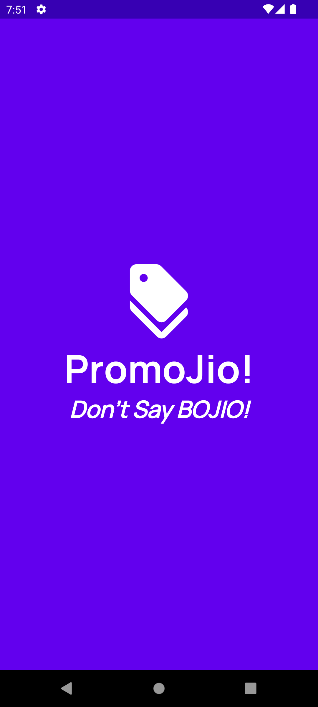
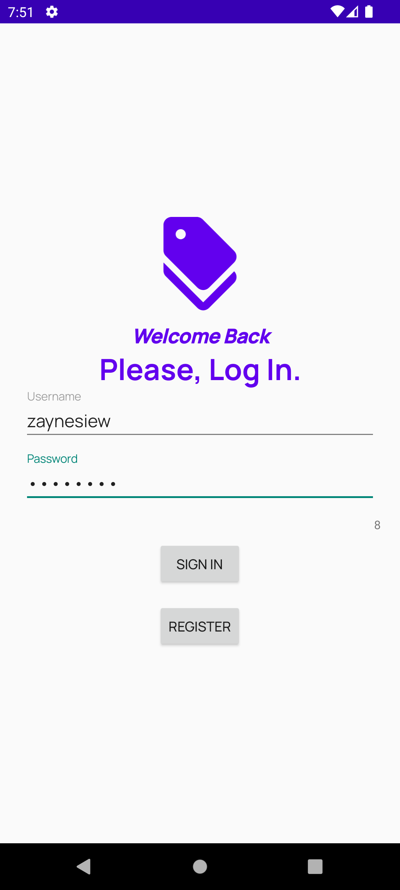
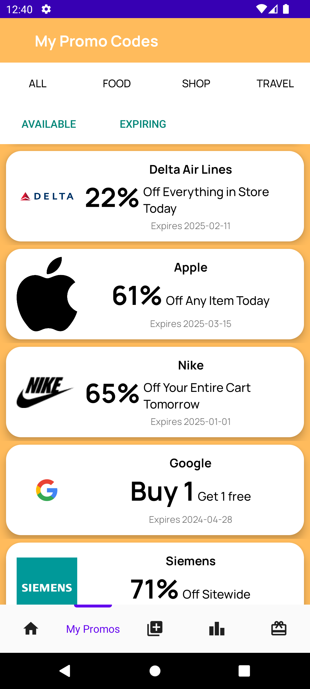
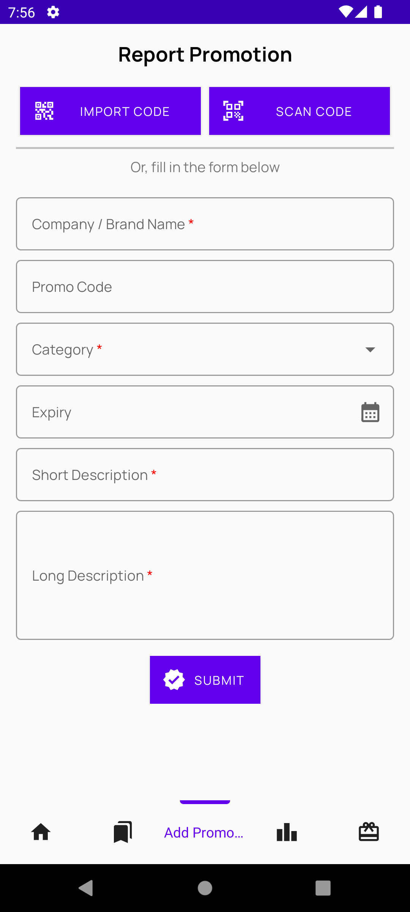
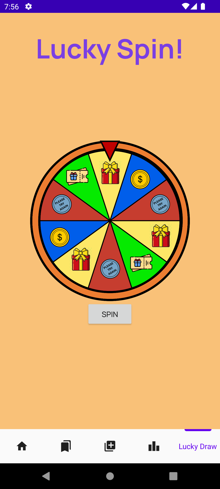

# PromoJio

  

    
    
  

  

  
Your one-stop app for all things discounts and promotions.

  
<b>Don't Say BOJIO!</b>

## Introduction

### Impetus

- The promotional code market is **cluttered and inefficient**, with users often wading through outdated or invalid codes on numerous untrustworthy websites.
- Codes are often **outdated or invalid**, and they **lack categorization** based on **user preferences and interests**.
- The lack of incentives for sharing promotional codes results in a **passive user base** that consumes more than it contributes, creating an environment where fresh, usable codes are **rare and quickly become obsolete**.

### Problem Statement

How might we **centralise the promo code usage and sharing experience for everyone**, and make **discount-hunting fun and rewarding again?**

Introducing PromoJio - the only app that tracks promo codes for you and rewards you for using them!

## App Screenshots

<table>
  <tr>
    <td>
      

        
        
Loading Page

      

    </td>
    <td>
      

        
        
Login Page

      

    </td>
    <td>
      

        
        
Home Page

      

    </td>
  </tr>
  <tr>
    <td>
      

        
        
Promo Code Overview Page

      

    </td>
    <td>
      

        
        
Promo Code Viewing Page

      

    </td>
    <td>
      

        
        
Scanner Page

      

    </td>
  </tr>
  <tr>
    <td></td>
    <td>
      

        
        
Lucky Wheel Page

      

    </td>
    <td></td>
  </tr>
</table>

## See Also

PromoJio Server - https://github.com/ashley-koh/promojio-server

## Acknowledgements

### External Libraries and References

- Animated Bottom Navigation Bar - https://github.com/Droppers/AnimatedBottomBar
- Google ML Toolkit (Vision Barcode Scanning) - https://developers.google.com/ml-kit/vision/barcode-scanning/android
- Volley (HTTP Library) - https://google.github.io/volley/

### Project Developers

Team 54

| Member                | Student Number |
|-----------------------|----------------|
| Ashley Koh Jia Jhin   | 1004197        |
| Siew Rui Ze, Zayne    | 1007180        |
| Tan Yan Lin, Charlese | 1007075        |
| Khoo Jing Heng        | 1007221        |
| Allison Yee Wen Chyi  | 1007020        |
| Asli Robin Rufo       | 1007212        |
| Austin Isaac          | 1007099        |

### Epilogue

This project is an undertaking of 50.001 Information Systems and Programming (2024 Spring) offered by Singapore University of Technology and Design (SUTD).
