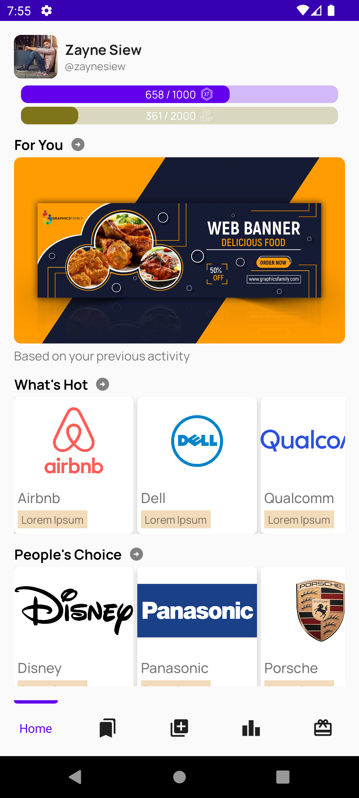
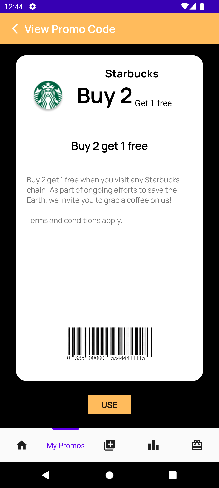

# PromoJio

  

    
    
  

  

  
Your one-stop app for all things discounts and promotions.</a>

  
<em>Don't Say BOJIO!</em>

## Impetus

The promotional code market is **cluttered and inefficient**, with users often wading through outdated or invalid codes on numerous untrustworthy websites.

Codes are often **outdated or invalid**, and they **lack categorization** based on **user preferences and interests**.

The lack of incentives for sharing promotional codes results in a **passive user base** that consumes more than it contributes, creating an environment where fresh, usable codes are **rare and quickly become obsolete**.

**How might we centralise the promo code usage and sharing experience for everyone, and make discount-hunting fun and rewarding again?**

Introducing PromoJio - the only app that tracks promo codes for you and rewards you for using them!

## App Screenshots

* 
* 
* 
* 
* 
* 
* 

## See Also

PromoJio Server - https://github.com/ashley-koh/promojio-server
